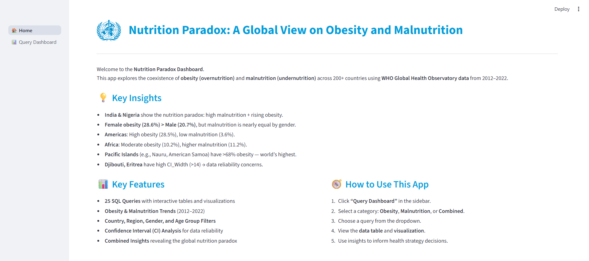

# Nutrition Paradox: A Global View on Obesity and Malnutrition

## 🖥️ App Screenshots

### Home Page

### Query Dashboard

This project explores the coexistence of **obesity (overnutrition)** and **malnutrition (undernutrition)** across 200+ countries using **WHO Global Health Observatory (GHO) data** from **2012–2022**. Built with Python, MySQL, and Streamlit, it delivers actionable insights for global health policymakers.

---

## 🎯 Business Use Cases
- **Nutrition Risk Monitoring**: Identify high-risk countries (e.g., Nauru, Eritrea).
- **Demographic Disparity Analysis**: Compare trends by gender, age, and region.
- **Data-Driven Policy Planning**: Prioritize funding based on dual burden evidence.
- **Comparative Region Analysis**: Contrast Africa vs. Americas, etc.
- **Public Health Reporting**: Deliver summarized insights to NGOs/governments.

---

## 🧪 Project Approach

### Step 1: Data Collection
Fetched 4 WHO API endpoints:
- **Obesity**: `NCD_BMI_30C` (Adults), `NCD_BMI_PLUS2C` (Children)
- **Malnutrition**: `NCD_BMI_18C` (Adults), `NCD_BMI_MINUS2C` (Children)

### Step 2: Data Cleaning & Feature Engineering
- Standardized columns (`Year`, `Gender`, `Mean_Estimate`, etc.)
- Converted ISO country codes to full names using `pycountry`
- Added derived columns:
  - `CI_Width = UpperBound - LowerBound`
  - `obesity_level` (High/Moderate/Low)
  - `malnutrition_level` (High/Moderate/Low)

### Step 3: EDA & Visualization
- Analyzed trends, disparities, and data reliability
- Created 25+ visualizations (line charts, bar plots, scatter plots)

### Step 4: SQL & Streamlit Integration
- Inserted cleaned data into **MySQL** tables: `obesity`, `malnutrition`
- Built an interactive **Streamlit dashboard** with 25 SQL queries

---

## 🔍 Key Insights
- **India & Nigeria** show the nutrition paradox: high malnutrition + rising obesity.
- **Female obesity (28.6%) > Male (20.7%)**, but malnutrition is nearly equal by gender.
- **Americas**: High obesity (28.5%), low malnutrition (3.6%).
- **Africa**: Moderate obesity (10.2%), higher malnutrition (11.2%).
- **Pacific Islands** (e.g., Nauru, American Samoa) have >68% obesity — world’s highest.
- **Djibouti, Eritrea** have high CI_Width (>14) → data reliability concerns.

---

